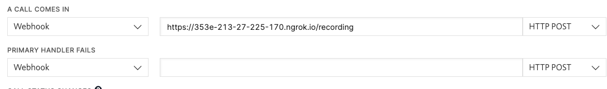

# Twilio PoC

The object of this PoC is building a very basic API that will manage:
 1. Incoming call webhook. This endpoint will send a voice message and will enable voice recording. Besides, it will set a recording status callback url. This url will be requested once the recording status changes.
 2. Recording status changed to "completed" webhook. This endpoint will be requested every time a recording changes its status to "completed". In this case, the app will run the according actions.

The app implements 2 endpoints:

- `/recording`, which manages all incoming calls.
- `/transcribe`, which manages changes in recording status.

## Set Up

To make this work, you will first need to run [ngrok](https://ngrok.com/) as a reverse proxy.

Then, expose the app port to the internet running

```
ngrok http 3000
```

and run this app locally using

```
npm run start:dev
```

Then, you will need to update your Twilio account configuration.
Choose an existing phone number or buy a new one. Then, edit its configuration, setting the field `A CALL COMES IN` with the values `Webhook`, `${https_ngrok_url}/recording`, and `HTTP POST`



Then, call to the number and follow the bot instructions. You'll be able to check in the app logs that the webhook was called.
Once you stop the call, if you wait a few seconds, you will also check that the app was notified that the recording is completed and ready to be used.
